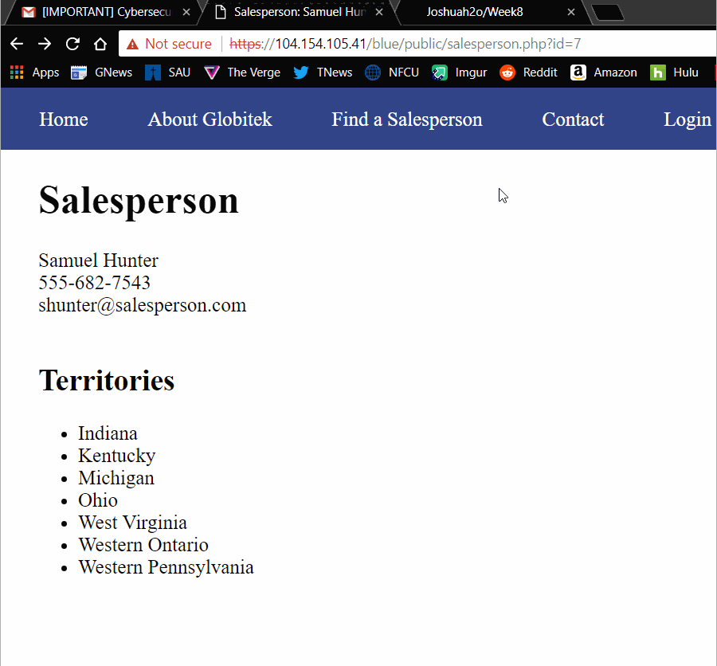
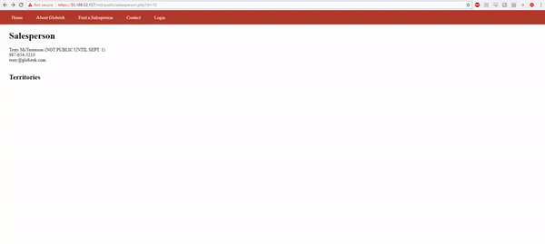
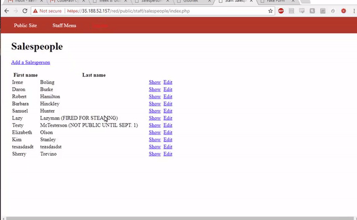

# Project 8 - Pentesting Live Targets

Time spent: **3** hours spent in total

> Objective: Identify vulnerabilities in three different versions of the Globitek website: blue, green, and red.

The six possible exploits are:
* Username Enumeration
* Insecure Direct Object Reference (IDOR)
* SQL Injection (SQLi)
* Cross-Site Scripting (XSS)
* Cross-Site Request Forgery (CSRF)
* Session Hijacking/Fixation

Each version of the site has been given two of the six vulnerabilities. (In other words, all six of the exploits should be assignable to one of the sites.)

## Blue
Vulnerability #3: SQL Injection   
In the blue site's salesperson page, injecting an SQL statement at the end of the salesperson url will succeed.
Inserting the statement ' OR SLEEP(5)=0--' will cause the site to wait 5 seconds before reloading the first salesperson, Daron Burke.
 

Vulnerability #6: Session Hijacking/Fixation  
In the red site, log in as a registered user (pperson). Now take the url of the red site, paste it in a new browser,
change 'red' to 'blue', and you will now have user priveleges on the blue site without actually having to log-in.
 

## Green

Vulnerability #1: Username Enumeration  
In the green site's log-in page, logging in as an invalid user will show an error message 'Log in was unsuccessful.'
However, logging in as a valid user with an incorrect password will show the same error message, except in bold. This allows
intruders to know whether a username exists in the database or not.  

Vulnerability #4: Cross-Site Scripting (XSS)  
In the green site's comment section, anyone can insert a stored XSS attack in the form of an alert by submitting a comment,
and a user of the site can see that alert message when they click on the feedback button. 
User comment:    
 
Logged in:   

## Red

Vulnerability #2: Insecure Direct Object Reference  
Salespeople can be accessed by specifying an id int in the url. On the red site, changing the salesperson id to
10 and 11 reveal 2 extra people that can't be accessed through IDOR on the blue and green site.  

Vulnerability #5: Cross-Site Request Forgery  
In the red site, you can create a post-method form that sends data to the ip address specified. In my case,
I created a new salesperson called 'Keller Han'.  

## Notes

Describe any challenges encountered while doing the work
